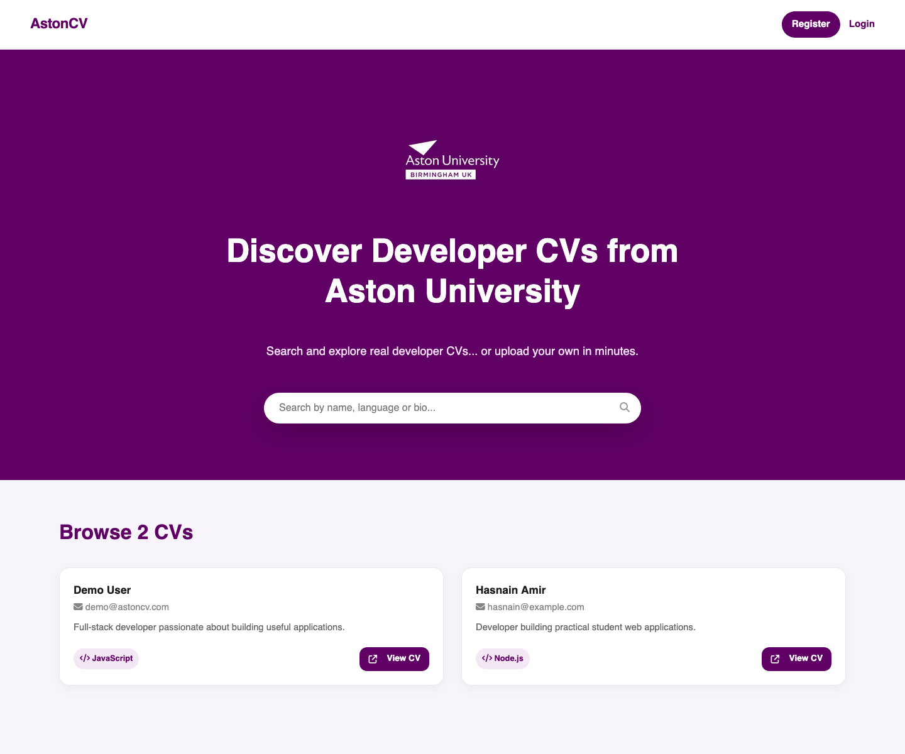

# 💼 CV Management System (Backend)


Backend for a full-stack CV management system built with Node.js, Express, EJS, and MySQL.

The application allows users to register, log in, view CVs, edit profile data, and search CVs in real time.

---

## 🚀 Features

- View all CVs
- View detailed CV profiles
- User registration
- User login and logout
- Edit CV information
- Live search
- Session-based authentication

---

## 📸 Preview



---

## 🔐 Security Features

- Password hashing using bcrypt
- CSRF protection
- Rate limiting on login attempts
- SQL injection protection using parameterised queries
- Security headers via Helmet

---

## 🧱 Architecture

The application follows an MVC-style structure:

- **Model** -> MySQL database
- **View** -> EJS templates
- **Controller** -> Express routes (`app.js`)

---

## 🛠️ Tech Stack

- Node.js
- Express
- EJS
- MySQL
- JavaScript
- bcrypt
- Helmet

---

## 📁 Project Structure

```text
app.js
package.json
public/
views/
```

## ⚙️ Running Locally

```bash
npm install
node app.js
```

## ⚠️ Notes

- Uses environment variables for sensitive configuration
- This repository contains the backend and server-rendered application code
- Frontend showcase is maintained separately for GitHub Pages

---

## 🔗 Related Repository

Frontend showcase:
https://github.com/hasnain-amir/cv-management-frontend

---

## 💡 Future Improvements

- Refactor routes and controllers into separate modules
- Add REST API endpoints
- Improve validation and error handling
- Deploy on a cloud platform such as Render or Railway
